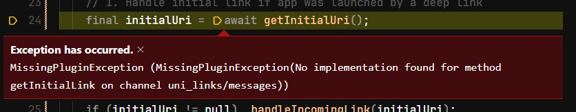
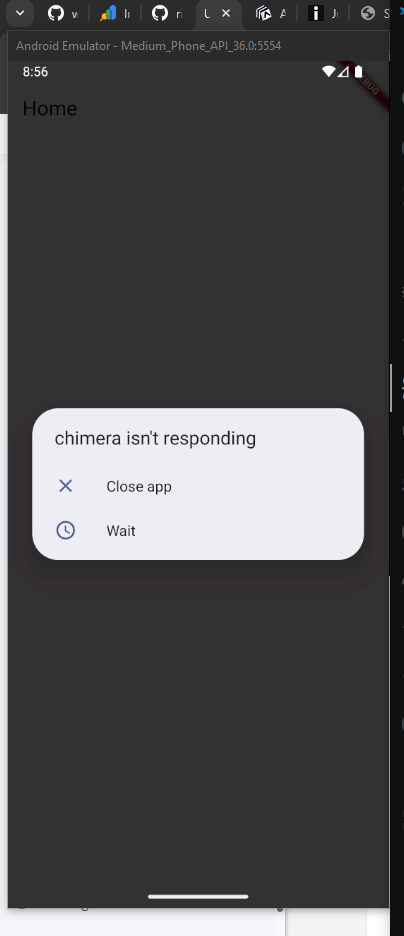

# Chimera - Deep Link Demo

[](https://flutter.dev)
[](https://dart.dev)
[](https://pub.dev/packages/app_links)

A Flutter application demonstrating deep linking implementation using the app_links package.

## Testing Deep Links

To test the deep link functionality, use the following adb command:

```bash
adb shell am start -a android.intent.action.VIEW -d "myapp://details/42" com.example.chimera
```

Replace `42` with any ID you want to test.

## Reflection Questions

### 1. Concept Check

**What is the difference between a route inside Flutter and a deep link at the Android level? Why does Android need an intent filter?**

A route inside Flutter is an internal navigation mechanism within the app that manages screen transitions using Flutter's `Navigator` widget. It operates entirely within the Flutter application layer and handles navigation between widgets/screens.

A deep link at the Android level is an external entry point that allows other applications or the system to launch your app and navigate to a specific screen. Android needs an intent filter declared in `AndroidManifest.xml` to register which URL schemes or patterns your app can handle. This tells the Android OS that your app is capable of responding to specific URLs, allowing the system to route those URLs to your app when they are triggered from external sources like browsers, other apps, or adb commands.

### 2. Technical Understanding

**Explain the role of the app_links package.**

The `app_links` package provides a cross-platform solution for handling deep links and universal/app links in Flutter applications. It abstracts the platform-specific implementation details and provides a simple API to:
- Listen for incoming deep links when the app is already running (via `uriLinkStream`)
- Handle initial deep links when the app is launched from a closed state (via `getInitialLink()`)
- Support multiple platforms including Android, iOS, Web, Linux, macOS, and Windows

This package replaced the deprecated `uni_links` package and offers better maintenance and more comprehensive platform support.

**What happens if a deep link is opened while the app is already running?**

If a deep link is opened while the app is already running, the `app_links` package captures the URI through the `uriLinkStream` listener. The stream emits the new URI, triggering the `_handleIncomingLink()` method which:
1. Updates the status message to show the received link
2. Parses the URI to extract parameters (like the ID)
3. Uses the `GlobalKey<NavigatorState>` to push a new screen onto the navigation stack

The app remains in the foreground and navigates to the appropriate screen without restarting.

### 3. Debugging Insight

**Suppose your adb command opens the app but it doesn't navigate to the detail page. What part of your code or manifest would you check first, and why?**

I would check in this order:

1. **AndroidManifest.xml intent-filter**: Verify that the intent filter is correctly configured with the right scheme and host. If the scheme doesn't match (e.g., `myapp` vs `myapps`), Android won't deliver the intent to your app.

2. **app_links initialization**: Ensure `initAppLinks()` is called in `initState()` and that both `getInitialLink()` and `uriLinkStream.listen()` are properly set up to handle links.

3. **URI parsing logic in `_handleIncomingLink()`**: Check if the `uri.host` and `uri.pathSegments` parsing matches the expected URL structure. A mismatch here means the link is received but not processed correctly.

4. **Navigator configuration**: Verify that the `GlobalKey<NavigatorState>` is properly assigned to the MaterialApp's `navigatorKey` property. Without this, `navigatorKey.currentState?.push()` will fail silently.

The manifest would be checked first because if Android doesn't recognize your app as a handler for that URL scheme, the intent will never reach your Flutter code.

## Wrap-Up Summary

### How Deep Linking Integrates Flutter Navigation with Android Intent Filters

Deep linking creates a bridge between Android's native intent system and Flutter's navigation framework. At the Android level, intent filters in `AndroidManifest.xml` declare which URL schemes the app can handle, allowing the operating system to recognize and route external URLs to the application. When a deep link is triggered, Android delivers the intent to the Flutter app, where the `app_links` package captures the URI and translates it into Flutter navigation commands. This integration enables seamless transitions from external sources directly to specific screens within the Flutter app, maintaining the app's internal navigation state while responding to external triggers.

### Practical Scenarios Where Deep Linking Is Useful

Deep linking provides significant value in several real-world applications. In notification systems, users can tap a push notification and be directed immediately to the relevant content, such as a new message or order status, rather than landing on the home screen. For shared links, users can share specific products, articles, or profiles via messaging apps or social media, and recipients can open those exact pages directly in the app. In authentication redirects, apps implementing OAuth or password reset flows can redirect users back from email links or browser sessions directly to the appropriate screen within the app, creating a seamless authentication experience.

### Challenges and Solutions

#### 1. uni_links Package Issues

The primary challenge encountered was with the deprecated `uni_links` package, which caused multiple issues:

**Build Failure:**
```
Could not create an instance of type com.android.build.api.variant.impl.LibraryVariantBuilderImpl.
Namespace not specified for uni_links.
```

**Runtime Exception:**



The app also threw a `MissingPluginException` at runtime when trying to use `uni_links` methods, indicating the plugin was not properly integrated with newer Flutter/Android versions.

Both issues were resolved by migrating to the modern `app_links` package, which provides better platform support and active maintenance:

```bash
flutter pub remove uni_links
flutter pub add app_links
```

#### 2. Navigation Context Issue

Another significant challenge was the navigation context issue, where attempting to use `Navigator.push` with `BuildContext` resulted in app crashes:



The app would show "chimera isn't responding" error when deep links were triggered. This was solved by implementing a `GlobalKey<NavigatorState>` to access the navigator directly without relying on context availability:

```dart
final GlobalKey<NavigatorState> navigatorKey = GlobalKey<NavigatorState>();

// In MaterialApp
navigatorKey: navigatorKey,

// In navigation
navigatorKey.currentState?.push(
  MaterialPageRoute(builder: (context) => DetailScreen(id: id)),
);
```

This ensures reliable navigation regardless of when the deep link arrives.

#### 3. Generated Plugin Files Conflict

Additionally, generated plugin registration files caused merge conflicts when pulling from the repository, which was resolved by using `git restore` to discard local changes to these auto-generated files before pulling updates:

```bash
git restore linux/flutter/generated_plugin_registrant.cc
git restore linux/flutter/generated_plugins.cmake
# ... and other generated files
git pull
```


## Package Information

- Package name: com.example.chimera
- URL scheme: myapp://
- Supported deep link format: myapp://details/{id}